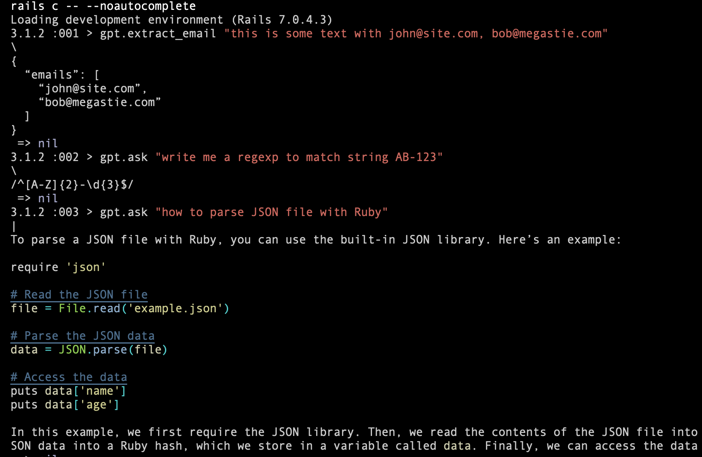
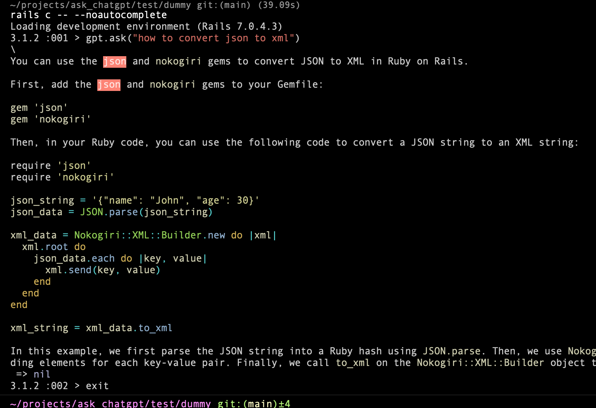
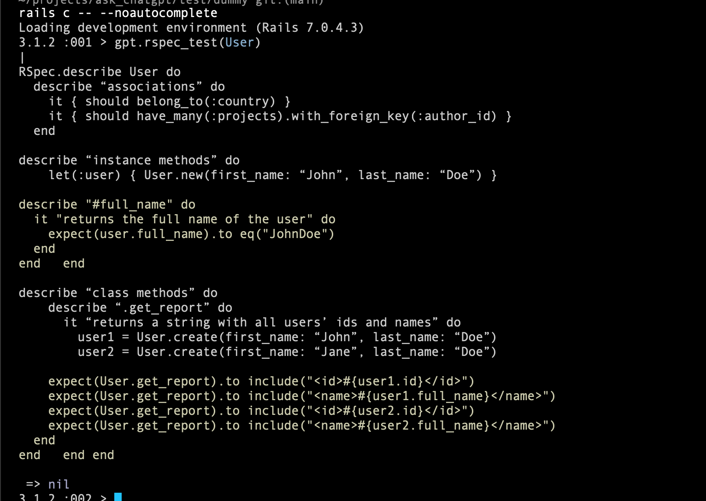
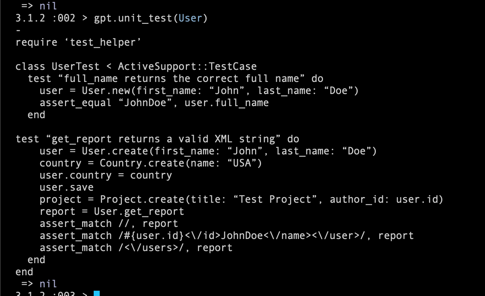
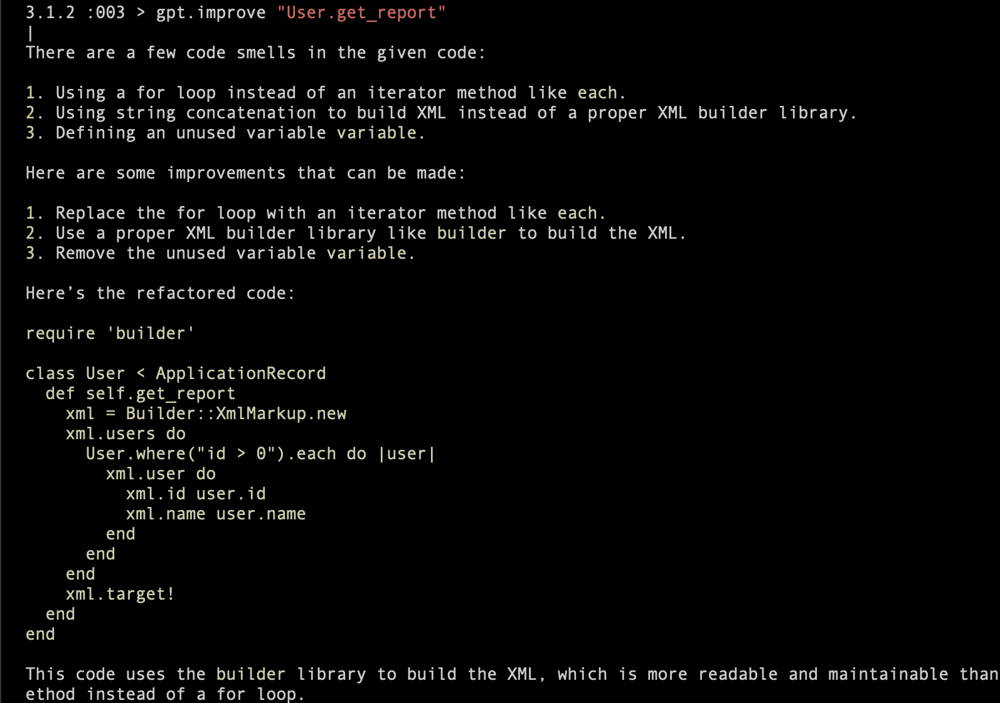
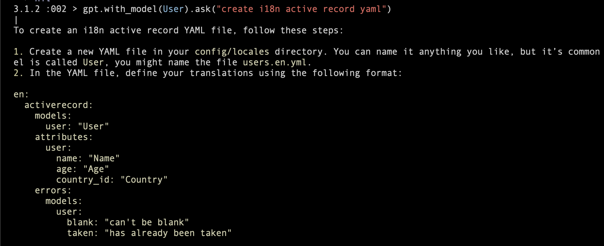

# AskChatGPT

[](https://www.railsjazz.com)
[](https://opensource-heroes.com/o/railsjazz)

AI-Powered Assistant Gem right in your Rails console.


A Gem that leverages the power of AI to make your development experience more efficient and enjoyable. With this gem, you can streamline your coding process, effortlessly refactor and improve your code, and even generate tests on the fly.

We are welcoming you to propose new prompts or adjust existing ones!

## Usage

Go to Rails console and run:

```ruby
  gpt.ask("how to get max age of user with projects from Ukraine").with_model(User, Project, Country)
  gpt.ask("convert json to xml")
  gpt.refactor("User.get_report")
  gpt.improve("User.get_report")
  gpt.rspec_test(User)
  gpt.unit_test(User)
  gpt.code_review(User.method(:get_report))
  gpt.find_bug('User#full_name')
  gpt.explain(User)
  gpt.improve %Q{
    def full_name
      [first_name, last_name].join
    end
  }
```

## Examples

Typical use-cases how you can use this plugin


Ask for code ideas:


Do you need help to write rspec test?


What about unit tests?


Ask ChatGPT to improve your code:


Create I18n YAML for your Model (custom prompt):


## Installation

Add this line to your application's Gemfile:

```ruby
gem "ask_chatgpt"
```

And then execute:
```bash
$ bundle
```

Or install it yourself as:
```bash
$ gem install ask_chatgpt
```

## Options & Configurations

Run `rails g ask_chatgpt initializer`.

And you can edit:

```ruby
  AskChatGPT.setup do |config|
    # config.access_token    = ENV["OPENAI_API_KEY"]
    # config.debug           = false
    # config.model           = "gpt-3.5-turbo"
    # config.temperature     = 0.1
    # config.max_tokens      = 3000 # or nil by default
    # config.included_prompt = []

    # Examples of custom prompts:
    # you can use them `gpt.ask(:extract_email, "some string")`

    # config.register_prompt :extract_email do |arg|
    #   "Extract email from: #{arg} as JSON"
    # end

    # config.register_prompt :extract_constants do |arg|
    #   "Extract constants from class: #{AskChatGPT::Helpers.extract_source(arg)}"
    # end

    # config.register_prompt :i18n do |code|
    #   "Use I18n in this code:\n#{AskChatGPT::Helpers.extract_source(code)}"
    # end
  end
```

Note: that you need to setup your API Key https://platform.openai.com/account/api-keys. You can store it in the .env or .bash_profile. BUT make sure it won't be committed to the Github. Is must be private.

You can define you own prompts and use them using `.register_prompt`. For example:

```ruby
  config.register_prompt :extract_email do |arg|
    "Extract email from: #{arg} as JSON"
  end
```

And later you can call it with `gpt.extract_email("some text with email@site.com, user@email.com")`.
If you believe your custom promts will be useful - create a PR for this gem.

If you want to get source code use this helper `AskChatGPT::Helpers.extract_source(str)`.

You can pass:

```ruby
  AskChatGPT::Helpers.extract_source('User.some_class_method')
  AskChatGPT::Helpers.extract_source('User#instance_method')
  AskChatGPT::Helpers.extract_source('User')
  AskChatGPT::Helpers.extract_source(User)
  AskChatGPT::Helpers.extract_source("a = b")
```

## Debug Mode

You can enable debug mode to see request/response from the OpenAI using two ways:

```ruby
AskChatGPT.setup do |config|
  config.debug = false
end
```

or directly in console `gpt.debug!` (and finish `gpt.debug!(:off)`)

## TODO

- cli app? `ask_gpt <something> --file <file>` ...
- more prompts (cover controllers, sql, etc?), e.g. `with_controller`, `with_class`, ...
- tests(rspec, vcr)
- CI (but first specs)
- can it be used with pry/byebug/etc?
- print tokens usage? `.with_usage`
- support org_id? in the configs
- use `gpt` in the code of the main app (e.g. model/controller)

## Contributing

You are welcome to contribute.

To start just clone this repo. Run bundle, and go to `cd test/dummy/`. Start `rails c` and test your prompts.

## License

The gem is available as open source under the terms of the [MIT License](https://opensource.org/licenses/MIT).
