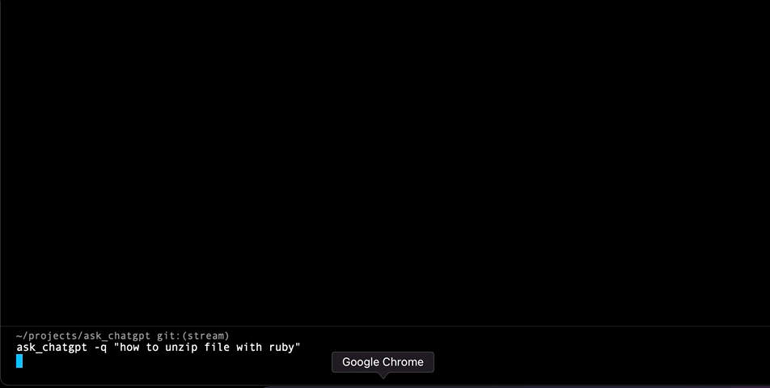

# Ask ChatGPT

[](https://www.railsjazz.com)
[](https://opensource-heroes.com/o/railsjazz)

AI-Powered Assistant Gem right in your Rails console.

NEW UPDATE: Voice input using your microphone, demo: https://youtu.be/uBR0wnQvKao


A Gem that leverages the power of AI to make your development experience more efficient and enjoyable. With this gem, you can streamline your coding process, effortlessly refactor and improve your code, and even generate tests on the fly.
+
See more [examples](#examples) below.

## Usage

Go to Rails console and run:

```ruby
  gpt.ask("how to get max age of user with projects from Ukraine").with_model(User, Project, Country)
  gpt.ask("convert json to xml")
  gpt.with_code("User.get_report", Project).ask "make it better" # with_class alias for with_code
  gpt.with_class(User).ask "make it better"
  gpt.payload(json).ask("extract emails from json")
  gpt.refactor("User.get_report")
  gpt.improve("User.get_report")
  gpt.rspec_test(User)
  gpt.unit_test(User)
  gpt.code_review(User.method(:get_report))
  gpt.find_bug('User#full_name')
  gpt.explain(User)
  gpt.improve %Q{
    def full_name
      [first_name, last_name].join
    end
  }
  #
  # --- NEW ---
  #
  gpt.speak # or with alias gpt.s
```

OR with CLI tool:

```shell
>ask_chatgpt -q "134*1245"
166830

>ask_chatgpt base64 this string "hello world"
aGVsbG8gd29ybGQ=

>ask_chatgpt decode base64 this string "aGVsbG8gd29ybGQ="
hello world
```

>ask_chatgpt -s 1 # start voice input with CLI

See some examples below. You can also create your own prompts with just few lines of code [here](#options--configurations).

Also you can use a CLI tool, [how to use it](#cli-tool).

## Examples

Typical use-cases how you can use this plugin


Ask for code ideas:


Do you need help to write rspec test?


What about unit tests?


Ask ChatGPT to improve your code:


Ask ChatGPT to parse you JSON:


Or it can encode in Base64 your string:


Create I18n YAML for your Model (custom prompt):


## Installation

Add this line to your application's Gemfile:

```ruby
gem "ask_chatgpt"
```

And then execute:
```bash
$ bundle
```

Or install it yourself as:
```bash
$ gem install ask_chatgpt
```

## Options & Configurations

Run `rails g ask_chatgpt initializer`.

And you can edit:

```ruby
  AskChatGPT.setup do |config|
    # config.access_token    = ENV["OPENAI_API_KEY"]

    # async mode will use OpenAI streamming feature and will return results as they come
    # config.mode             = :async # or :sync
    # config.markdown         = true # try to output nicely Markdown response
    # config.debug            = false
    # config.model            = "gpt-3.5-turbo"
    # config.temperature      = 0.1
    # config.max_tokens       = 3000 # or nil by default
    # config.included_prompts = []

    # enable voice input with `gpt.speak` or `gpt.s`. Note, you also need to configure `audio_device_id`
    # config.voice_enabled = true

    # to get audio device ID (index in the input devices)
    # install ffmpeg, and execute from the console
    # `ffmpeg -f avfoundation -list_devices true -i ""`
    # config.audio_device_id = 1

    # after "voice_max_duration" seconds it will send audio to Open AI
    # config.voice_max_duration = 10 # 10 seconds

    # Examples of custom prompts:
    # you can use them `gpt.extract_email("some string")`

    # config.register_prompt :extract_email do |arg|
    #   "Extract email from: #{arg} as JSON"
    # end

    # config.register_prompt :extract_constants do |arg|
    #   "Extract constants from class: #{AskChatGPT::Helpers.extract_source(arg)}"
    # end

    # config.register_prompt :i18n do |code|
    #   "Use I18n in this code:\n#{AskChatGPT::Helpers.extract_source(code)}"
    # end
  end
```

Note: that you need to setup your API Key https://platform.openai.com/account/api-keys. You can store it in the .env or .bash_profile.

Example with `nano ~/.bash_profile`:

```
export OPENAI_API_KEY=key
```

BUT make sure it won't be committed to the Github. Is must be private.

You can define you own prompts and use them using `.register_prompt`. For example:

```ruby
  config.register_prompt :extract_email do |arg|
    "Extract email from: #{arg} as JSON"
  end
```

And later you can call it with `gpt.extract_email("some text with email@site.com, user@email.com")`.
If you believe your custom prompt will be useful - create a PR for this gem.

If you want to get source code use this helper `AskChatGPT::Helpers.extract_source(str)`.

You can pass:

```ruby
  AskChatGPT::Helpers.extract_source('User.some_class_method')
  AskChatGPT::Helpers.extract_source('User#instance_method')
  AskChatGPT::Helpers.extract_source('User')
  AskChatGPT::Helpers.extract_source(User)
  AskChatGPT::Helpers.extract_source("a = b")
```

By default when you use in Rails app default one prompt is included (`.included_prompts`) which is sending Ruby/Rails versions, and name of the database adapter.

## Debug Mode

You can enable debug mode to see request/response from the OpenAI using two ways:

```ruby
AskChatGPT.setup do |config|
  config.debug = false
end

# or

# gpt.on!(:debug)
# gpt.off!(:debug)
```

or directly in console `gpt.debug!` (and finish `gpt.debug!(:off)`)

## Voice Input

Demo: https://youtu.be/uBR0wnQvKao

For now I consider this as an experimental and fun feature. Look forward seeing your feedback.

Works with command: `gpt.speak` or `gpt.s` (alias).

This command starts recording right away and it will stop after `voice_max_duration` seconds or if you press any key.

To exit recording mode press `Q`.

Voice is using `ffmpeg` tool, so you need to install it. Some instruction like this will work: https://www.hostinger.com/tutorials/how-to-install-ffmpeg.

Also, you need to configure `audio_device_id`. Run `ffmpeg -f avfoundation -list_devices true -i ""`

It will give you list of all devices, like this:

```s
ffmpeg -f avfoundation -list_devices true -i ""
ffmpeg version 6.0 Copyright (c) 2000-2023 the FFmpeg developers
  built with Apple clang version 14.0.0 (clang-1400.0.29.202)
  configuration: --prefix=/usr/local/Cellar/ffmpeg/6.0 --enable-shared --enable-pthreads --enable-version3 --cc=clang --host-cflags= --host-ldflags= --enable-ffplay --enable-gnutls --enable-gpl --enable-libaom --enable-libaribb24 --enable-libbluray --enable-libdav1d --enable-libmp3lame --enable-libopus --enable-librav1e --enable-librist --enable-librubberband --enable-libsnappy --enable-libsrt --enable-libsvtav1 --enable-libtesseract --enable-libtheora --enable-libvidstab --enable-libvmaf --enable-libvorbis --enable-libvpx --enable-libwebp --enable-libx264 --enable-libx265 --enable-libxml2 --enable-libxvid --enable-lzma --enable-libfontconfig --enable-libfreetype --enable-frei0r --enable-libass --enable-libopencore-amrnb --enable-libopencore-amrwb --enable-libopenjpeg --enable-libspeex --enable-libsoxr --enable-libzmq --enable-libzimg --disable-libjack --disable-indev=jack --enable-videotoolbox
  libavutil      58.  2.100 / 58.  2.100
  libavcodec     60.  3.100 / 60.  3.100
  libavformat    60.  3.100 / 60.  3.100
  libavdevice    60.  1.100 / 60.  1.100
  libavfilter     9.  3.100 /  9.  3.100
  libswscale      7.  1.100 /  7.  1.100
  libswresample   4. 10.100 /  4. 10.100
  libpostproc    57.  1.100 / 57.  1.100
[AVFoundation indev @ 0x7f7fd1a04380] AVFoundation video devices:
[AVFoundation indev @ 0x7f7fd1a04380] [0] FaceTime HD Camera
[AVFoundation indev @ 0x7f7fd1a04380] [1] USB Camera VID:1133 PID:2085
[AVFoundation indev @ 0x7f7fd1a04380] [2] Capture screen 0
[AVFoundation indev @ 0x7f7fd1a04380] [3] Capture screen 1
[AVFoundation indev @ 0x7f7fd1a04380] AVFoundation audio devices:
[AVFoundation indev @ 0x7f7fd1a04380] [0] Microsoft Teams Audio
[AVFoundation indev @ 0x7f7fd1a04380] [1] Built-in Microphone
[AVFoundation indev @ 0x7f7fd1a04380] [2] Unknown USB Audio Device
: Input/output error
```

In my case I used "1", because it's `Built-in Microphone`.

## CLI Tool

You can ask questions from cli or even start voice input.

Example 1:


Example 2:


How to use:

```
  ask_chatgpt -q "How to parse JSON file in Ruby?"
  ask_chatgpt -t 0.7 -q "How to parse JSON file in Ruby?"
  ask_chatgpt -f app/models/user.rb -q "find a bug in this Rails model"
  ask_chatgpt -f app/models/user.rb -q "create RSpec spec for this model"
  ask_chatgpt -f test/dummy/Gemfile -q "sort Ruby gems alphabetically"
  ask_chatgpt -m 3.5 -q "How to parse JSON file in Ruby?"
  ask_chatgpt -m 4 -q "Why Ruby is the best language?"
```

You can also create an alias "a" or "q" for example:

Edit file: `nano ~/.bash_profile`

```bash
alias a='ask_chatgpt'
alias q='ask_chatgpt'
```

and now you can use `q "how to unzip file with Ruby"`

## Streaming (async vs sync mode)

Control the mode from a console. Or, from the initializer, using `config.mode = :async` (or sync).

```ruby
  gpt.async!
  gpt.sync!
```

## Random Tips

Surprise yourself with random facts and useful tips. To use just call `gpt.random` (or `gpt.tip`, `gpt.random_tip`).

By default it's using Ruby/Rails topics (see `RandomTip` class).

But you can also use other topics, e.g.:

```ruby
  gpt.tip
  gpt.tip("active record")
  gpt.tip("sidekiq")
  gpt.tip("security")
```

## Markdown

Try to format response from Markdown and print it nicely in the console.

```ruby
AskChatGPT.setup do |config|
  config.markdown = true
end

# or

# gpt.on!(:markdown)
# gpt.off!(:markdown)
```

## TODO

- better CLI?
- more prompts (cover controllers, sql, etc?), e.g. `with_controller`, `with_class`, ...
- tests(rspec, vcr)
- can it be used with pry/byebug/etc?
- print tokens usage? `.with_usage`
- support org_id? in the configs
- use `gpt` in the code of the main app (e.g. model/controller)
- when voice is used add support for payloads, e.g. `gpt.with_payload(json).speak` (and it will send payload with my question)
- refactor voice input code :) as first version it's fine
- can we discover audio device ID?
- use tempfile for audio, instead of output.wav
- handle case when empty response is returned in CLI (when for example non-existing model is specified)

## Contributing

We are welcoming you to propose new prompts or adjust existing ones!

To start just clone this repo. Run bundle, and go to `cd test/dummy/`. Start `rails c` and test your prompts.

## License

The gem is available as open source under the terms of the [MIT License](https://opensource.org/licenses/MIT).

[](https://www.railsjazz.com/?utm_source=github&utm_medium=bottom&utm_campaign=ask_chatgpt)
